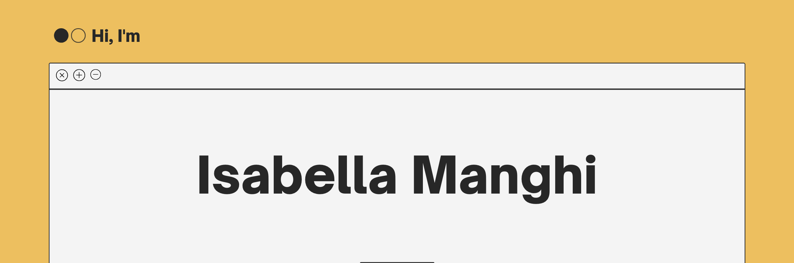

[]
[![Lisits Badge]https://badges.pufler.dev/visits/isa-manghi]
[![LinkedIn Badge]https://img.shields.io/badge/dynamic/json?url=<https://www.linkedin.com/in/aisabellam/>&label=<LinkedIn>-<Profile>-<blue>]

### Hi there 👋

I'm Isabella, Software engineer, Certified Lead ISO 27001 Implementer, and polyglot.

## 😄 Pronouns: She/Her

## 🖥️ Tech Stack

Language: Golang
APIs: Postman
Data: MongoDB, DataDog
Deployment: Docker, AWS, Kubernetes
Source Control: Git, GitHub

## 📝 Some things i've written

- Burden or benefit: Do standards work for IoT SMEs? [https://www.bsigroup.com/globalassets/documents/iot/ucl-bsi-mpa-project-report-2.pdf]
- The future of digital poachers – where to for digital conservation? [https://blogs.ucl.ac.uk/steapp/2019/07/29/the-future-of-digital-poachers-where-to-for-digital-conservation/]

## 🧮 GitHub Stats

### 🌐 Top Languages

<!--
**isa-manghi/isa-manghi** is a ✨ _special_ ✨ repository because its `README.md` (this file) appears on your GitHub profile.

Here are some ideas to get you started:

- 🔭 I’m currently working on ...
- 🌱 I’m currently learning ...
- 👯 I’m looking to collaborate on ...
- 🤔 I’m looking for help with ...
- 💬 Ask me about ...
- 📫 How to reach me: ...
- 😄 Pronouns: ...
- ⚡ Fun fact: ...
-->
